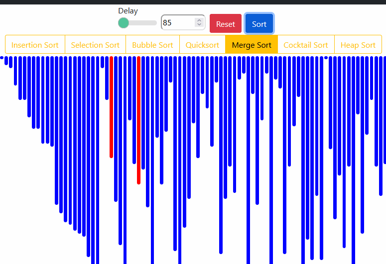
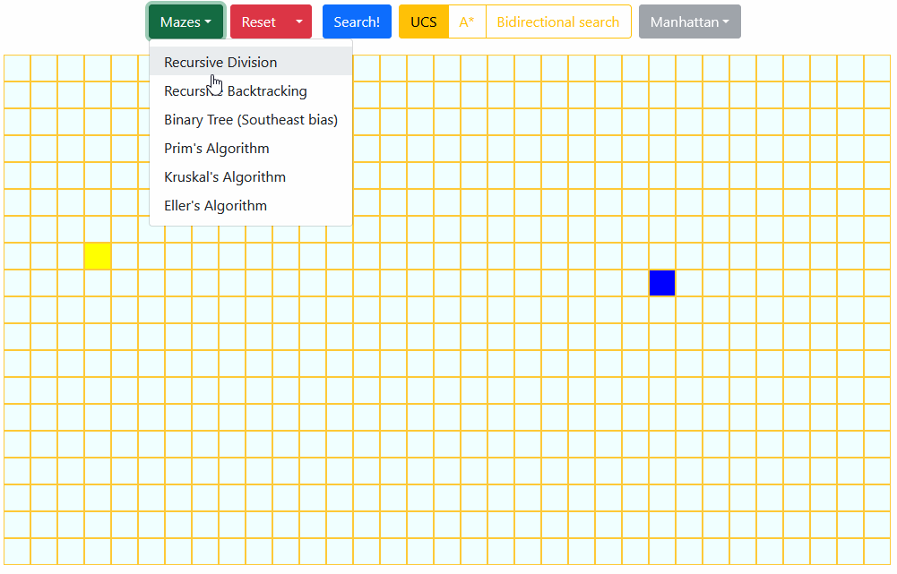

# algorithm-visualizer
This project visualizes various sorting, pathfinding, and maze generating algorithms in Typescript.

Sorting                    |  Maze + Pathfinding
:-------------------------:|:-------------------------:
   |  

To view this app in action, vist [https://puh00.github.io/algorithm-visualizer/](https://puh00.github.io/algorithm-visualizer/)

For more info on the maze generating algorithms, visit [The Buckblog](https://weblog.jamisbuck.org/2011/2/7/maze-generation-algorithm-recap).
